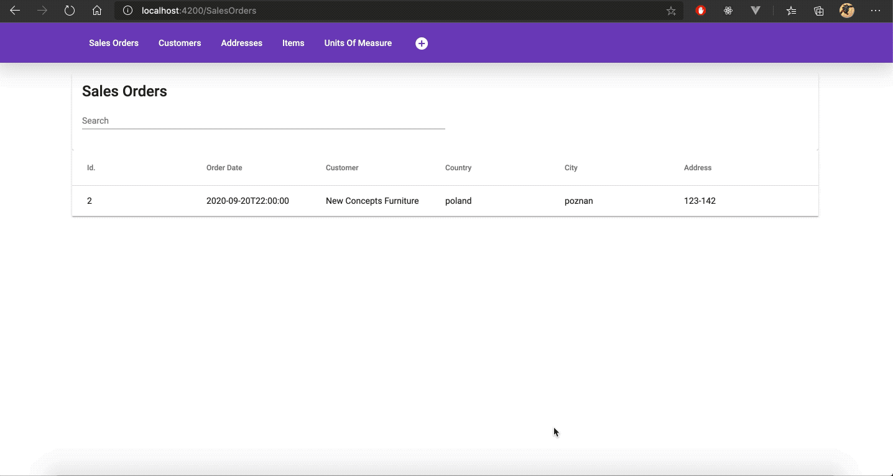
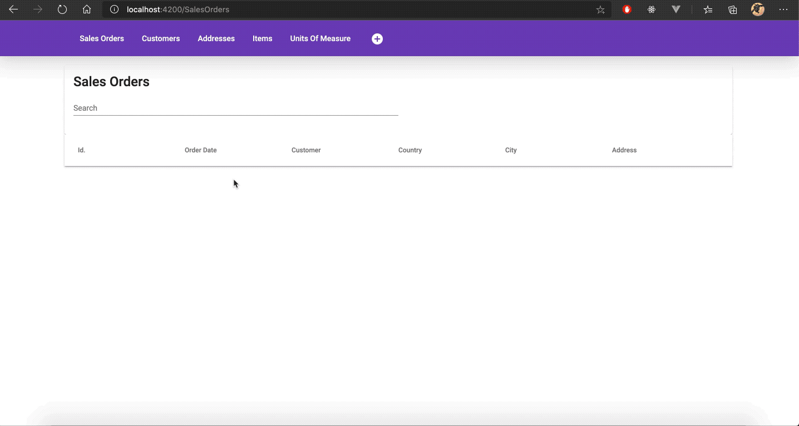
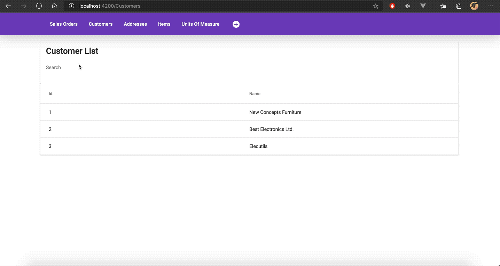

# Order Management System
## Overview
This is a simple order management system that allows you to perform CRUD operations on Customers, Addresses, Items, Sales Orders and other entities. The application consists of two components - a web api connected to Postgre SQL database and a web client.

The API was created using [asp.net core](https://docs.microsoft.com/pl-pl/aspnet/core/introduction-to-aspnet-core?view=aspnetcore-3.1) and entity framework. It supports CRUD operations for all available resources and provides documentation via Swagger UI.

The client application created using Angular provides an interface for the users. You can create new sales orders for customers and automaticallu calculate the profit!



You can view all the necessary information by browsing the list views!



All the lists provide a simple interface to sort and filter the data!



## Running the application
### API
In order to run the web api you have to perform fallowing steps:
* Create a Postgre SQL database and adjust the connection string accordingly.
* Create initial migration using ```dotnet ef migrations add <name>```
* Apply the migration using ```dotnet ef database update```
* Create required sql functions using the [create functions script](./OMS-API/Migrations/CreateFunctions.sql)
* Build and run the application using ```dotnet run```

### Web client
To run the web client you have to fallow this instructions:
* Install node modules using ```npm install```
* Run the development server using ```ng serve```
